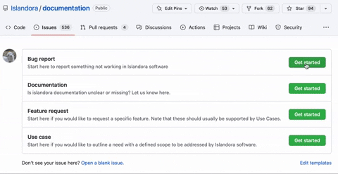

# Create a GitHub Issue

## Overview
The Islandora community uses GitHub issues to track bug reports, requests for improvements, requests for new features, and use cases. Issues are welcome from anyone who works with Islandora.

The Islandora [issue queue](https://github.com/Islandora/documentation/issues) is maintained in the Islandora [Documentation](https://github.com/Islandora/documentation) repository on GitHub. Issues posted to the queue are reviewed weekly on the Islandora [Tech Call](https://github.com/Islandora/islandora-community/wiki/Tech-Call-Meetings-2022). Members of the Islandora community can then respond to posted issues by replying with comments, taking on the assignment to do the work described in the issue, or making pull requests relating to the issue.

!!! Tip "Video version available"
    The material in this tutorial is presented in our video, [Create a GitHub Issue](https://youtu.be/eHBIYlRxEtk).

## Before you start

- You will need to have an account on [GitHub](https://github.com/join). These are free to register and require only a name and email address.

## How to create an issue in the Islandora issue queue

1. Go to [https://github.com/Islandora/documentation/issues](https://github.com/Islandora/documentation/issues)
2. Click on **New issue**:

3. Select the type of issue you are creating, as this will provide you with a template to describe your issue. 

4. Fill in the information for your issue:
    1. Give your issue a descriptive title following the text that is already provided in the template title, ex. _[BUG]._
    2. Fill in the body of your issue under the **Write** tab. A template of questions will be provided based on the type of issue selected. Depending on your issue, you may need to: describe a bug you are seeing and how to reproduce it, describe how an existing feature could be improved, describe a new feature and how it should work, or describe documentation that needs to be written or expanded.
    3. Use the built-in text editor to help format your issue in [Markdown](http://en.wikipedia.org/wiki/Markdown).
    4. Use the **Preview** button to see how your issue will be published and ensure the formatting looks the way you want.
    5. Click **Submit new issue** to add your issue to the queue.
    6. Optionally, Add labels to your issue to assign it to available categories, such as "documentation" or "question." Click on as may labels as you like. When you click outside of the drop-down list, the selected labels will be applied to your issue.
    
     

